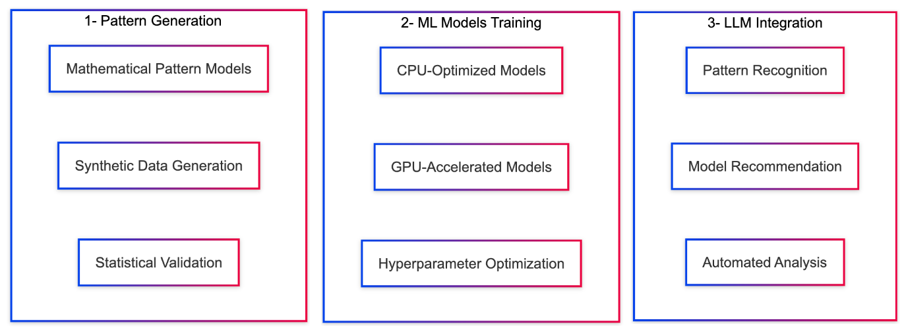

# Predictive Horizontal Pod Autoscaling: A Pattern-Aware Framework with Large Language Model Integration

## 🎯 Project Overview

This repository contains the complete implementation and research framework for **"LLM Pattern Recognition for Predictive Horizontal Pod Autoscaling"** - a comprehensive master thesis research project that establishes foundational components for intelligent Kubernetes autoscaling through integration of advanced machine learning techniques, sophisticated hyperparameter optimization frameworks, and automated pattern recognition capabilities.

### 🔬 Research Context

Traditional Kubernetes autoscaling relies on reactive heuristic methods that fail to capture complex temporal dependencies in modern microservices workloads. This research addresses these limitations through the development of Predictive Horizontal Pod Autoscaling (PHPA) incorporating advanced hyperparameter optimization frameworks that anticipate future resource requirements before they manifest as performance bottlenecks.

## 🏗️ System Architecture

The research framework consists of three interconnected modules that collectively establish a comprehensive approach to intelligent autoscaling:



## 📊 Key Research Contributions

### 1. **Comprehensive Pattern Taxonomy** (Module 1)
- **Six mathematically-formulated pattern types** covering the full spectrum of production workload behaviors
- **Over 2 million data points** across 600 distinct scenarios for robust algorithm evaluation
- **Real-world calibration** validated against NASA web servers, FIFA World Cup datasets, and cloud application logs
- **Statistical rigor** with 15-minute granularity over 35-day periods with realistic Kubernetes constraints

### 2. **Advanced Model Selection Framework** (Module 2)
- **37.4% average improvement** in forecasting accuracy through pattern-specific model selection
- **Seven CPU-optimized models** with comprehensive hyperparameter optimization
- **Production-ready performance** with training times 0.02-0.61s, memory usage 42-210MB
- **Advanced optimization strategies** including temporal cross-validation and early stopping

### 3. **LLM-Powered Pattern Recognition** (Module 3)
- **96.7% overall accuracy** in pattern classification with Gemini 2.5 Pro
- **Multimodal analysis** supporting both text-based CSV and visual chart analysis
- **Automated model recommendation** based on detected workload patterns
- **Democratic access** to sophisticated temporal analysis capabilities

## 🔗 Module Integration and Relationships

### Data Flow Architecture
1. **Pattern Generation** → Creates comprehensive synthetic datasets representing six fundamental workload types
2. **Model Training** → Evaluates forecasting models across generated patterns with optimization
3. **LLM Recognition** → Automatically identifies patterns and recommends optimal models
4. **PHPA Framework** → Integrates all components for intelligent autoscaling decisions

### Mathematical Foundation
The research establishes pattern-driven optimization as:

```
min θᵢ E[L(yₜ, fᵢ(xₜ; θᵢ))] subject to pₜ ∈ Pᵢ
```

Where `fᵢ` represents the optimal model for pattern type `i`, `θᵢ` denotes pattern-specific optimized hyperparameters, and `Pᵢ` defines the pattern classification space.

## 📁 Repository Structure

```
phpa/
├── 1-dataset-generation/           # Module 1: Pattern Generation System
│   ├── scripts/                    # Pattern generation and validation
│   │   ├── patterns/              # Six pattern implementations
│   │   ├── config/                # Configuration management
│   │   └── utils/                 # Utilities and plotting
│   └── README.md                  # Detailed module documentation
│
├── 2-ml-training/                 # Module 2: ML Model Training Framework
│   ├── scripts/                   # Training and evaluation scripts
│   │   ├── cpu-models/           # Production-ready CPU models
│   │   └── gpu-models/           # Advanced GPU-accelerated models
│   └── README.md                 # Detailed module documentation
│
├── 3-llm-pattern-recognition/     # Module 3: LLM Integration System
│   ├── scripts/                   # LLM evaluation and benchmarking
│   ├── config.yaml.example       # Configuration template
│   └── README.md                 # Detailed module documentation
│
├── sections-en/                   # Academic Paper Sections
│   ├── 1-introduction.tex        # Research introduction and context
│   ├── 7-architecture.tex        # Proposed PHPA architecture
│   ├── 8-discussion.tex          # Critical analysis and implications
│   ├── 9-conclusion.tex          # Conclusions and future directions
│   ├── 10-acknowledgment.tex     # Acknowledgments
│
└── README.md                     # This comprehensive overview
```

## 🚀 Quick Start Guide

### Prerequisites
- Python 3.8+
- Docker (optional, for containerized deployment)
- Kubernetes cluster (for production testing)
- API keys for LLM providers (Gemini, Qwen, Grok)

### 1. Dataset Generation
```bash
cd 1-dataset-generation/scripts
python generate_patterns.py --output-dir complete_dataset --days 35
```

### 2. Model Training
```bash
cd 2-ml-training/scripts
python train-models.py --models "xgboost,lightgbm,prophet"
```

### 3. LLM Pattern Recognition
```bash
cd 3-llm-pattern-recognition
cp config.yaml.example config.yaml
# Configure API keys
python scripts/enhanced_benchmark.py --llm all --method all
```

## 📈 Research Results and Validation

### Empirical Performance Metrics

| Component | Metric | Result |
|-----------|--------|--------|
| **Pattern-Specific vs Universal** | MAE Improvement | **37.4%** |
| **LLM Pattern Recognition** | Overall Accuracy | **96.7%** |
| **Model Training Time** | Range | **0.02-0.61s** |
| **Memory Usage** | Range | **42-210MB** |
| **Dataset Coverage** | Total Data Points | **2M+** |
| **Scenario Diversity** | Unique Scenarios | **600** |

### Pattern-Model Optimization Results

| Pattern Type | Optimal Model | Win Rate | MAE | Optimization Strategy |
|--------------|---------------|----------|-----|----------------------|
| **Growing** | VAR | 96% | 2.44 | BIC lag selection |
| **On/Off** | CatBoost | 62% | 0.87 | Ordered boosting |
| **Seasonal** | GBDT | 45% | 1.89 | Learning rate-depth optimization |
| **Burst** | GBDT | 42% | 2.13 | Histogram-based construction |
| **Chaotic** | GBDT | 38% | 2.45 | Advanced regularization |
| **Stepped** | GBDT | 35% | 1.97 | Depth optimization |

## 🔬 Scientific Methodology

### 1. Pattern Taxonomy Development
Six fundamental Kubernetes workload patterns with mathematical formulations:

- **Seasonal**: `P_t = B + ∑A_k sin(2πt/T_k + φ_k) + N_t`
- **Growing**: `P_t = B + G·f(t) + S·sin(2πh_t/24) + N_t`
- **Burst**: `P_t = B + ∑B_i·g(t-t_i,d_i)·1_{t_i≤t<t_i+d_i} + N_t`
- **On/Off**: `P_t = {P_high + N_t^high if S_t=1; P_low + N_t^low if S_t=0}`
- **Chaotic**: Complex multi-component irregular patterns
- **Stepped**: `P_t = B_base + L_t·S_step + S·sin(2πh_t/24) + N_t`

### 2. Advanced Optimization Framework
- **Temporal Cross-Validation**: Time series structure preservation
- **Early Stopping**: Validation-based convergence criteria
- **Hyperparameter Optimization**: Pattern-adaptive parameter selection
- **Statistical Validation**: Comprehensive performance metrics

### 3. LLM Integration Methodology
- **Multi-Provider Evaluation**: Gemini 2.5 Pro, Qwen3, Grok-3
- **Dual Analysis Methods**: Text-based CSV and visual chart analysis
- **Sophisticated Prompting**: Mathematical formulation integration
- **Optimal Case Selection**: 120 strategically selected scenarios

## 📊 Academic Publications and Documentation

### Module-Specific Documentation
Each module contains comprehensive README files with:
- Detailed technical specifications
- Usage examples and tutorials
- Performance benchmarks
- Research methodology explanations

## 🤝 Contributing and Extension

### Adding New Components
1. **Pattern Types**: Extend `BasePattern` interface for additional temporal behaviors
2. **ML Models**: Implement standardized model interfaces for new forecasting approaches
3. **LLM Providers**: Add new LLM architectures following provider abstraction patterns
4. **Optimization Strategies**: Enhance hyperparameter optimization frameworks

### Research Extensions
- **Real-world Validation**: Production deployment studies
- **Advanced Prompt Engineering**: Sophisticated LLM interaction strategies
- **Federated Learning**: Collaborative model improvement across organizations
- **Multi-objective Optimization**: Cost-performance-accuracy optimization

## 🎓 Citation and Academic Usage

If you use this research framework in your work, please cite:

```bibtex
@mastersthesis{duman2025phpa,
  title={KUBERNETES ÜZERİNDE TAHMİN ALGORİTMALARI İLE YÜKSEK ÖLÇEKLENEBİLİRLİK},
  author={Duman, Canberk and Eken, Süleyman},
  school={Kocaeli University},
  year={2025},
  type={Master Thesis}
}
```

## License and Usage

This research framework is released under the MIT License. The comprehensive documentation, empirical validation results, and architectural blueprints are provided for academic research and practical implementation of intelligent Kubernetes autoscaling systems.

## Future Research Directions

### Immediate Opportunities
- **Production Validation**: Real-world deployment studies across diverse environments
- **Advanced LLM Integration**: Sophisticated prompt engineering and ensemble methods
- **Pattern Evolution**: Dynamic pattern transition detection and adaptation
- **Cost Optimization**: Economic efficiency and resource utilization analysis

### Long-term Vision
- **Federated Intelligence**: Collaborative learning across organizational boundaries
- **Multi-cloud Orchestration**: Cross-cloud intelligent resource management
- **Edge Computing Integration**: Hierarchical scaling for edge-cloud continuum
- **Business Objective Integration**: Multi-objective optimization with economic constraints

---

**Research Framework Version**: 1.0  
**Researchers**: Canberk Duman and Asst. Prof. Dr. Suleyman Eken (Supervisor)
**Institution**: Kocaeli University, Department of Information Systems Engineering  
**Year**: 2025

## 🙏 Acknowledgments

This research is supported by **TÜBİTAK 1005** (Türkiye Bilimsel ve Teknolojik Araştırma Kurumu).

For questions, issues, or collaboration opportunities, please refer to the detailed documentation in each module or contact the research team through the academic institution.
